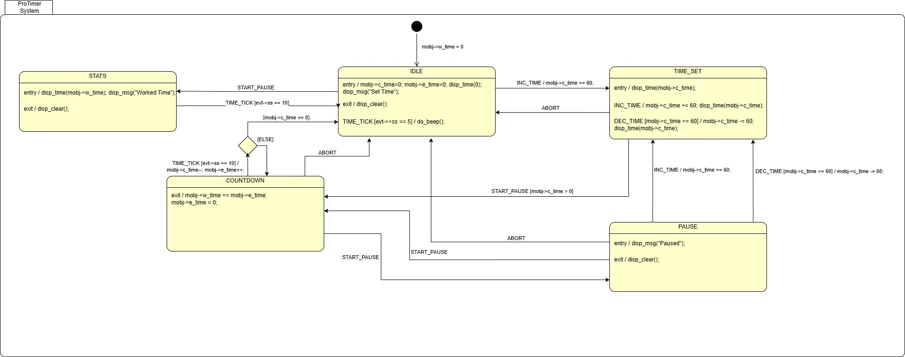

# STM32 Productivity Timer

A countdown timer system for STM32 microcontrollers to track work productivity sessions with mm:ss display and audio feedback.

---

## Table of Contents
- [Overview](#overview)
- [Features](#features)
- [System Behavior](#system-behavior)
- [User Interface](#user-interface)
- [Requirements](#requirements)
- [Getting Started](#getting-started)

---

## Overview

The Productivity Timer helps you manage work sessions with configurable countdown, pause/resume functionality, and statistics tracking. Features visual display feedback and audio alerts.

> **Note:** This project is originally a proposed exercise from the [FastBit Embedded Brain Academy - UML State Machine Design course](https://fastbitlab.com/).

---

## Features

- ⏱️ **Configurable Sessions**: Set work periods in 1-minute increments
- ▶️ **Start/Pause Control**: Full countdown control
- ⏸️ **Mid-Session Adjustments**: Modify timer while paused
- 📊 **Work Statistics**: Track total worked time
- 🔊 **Audio Feedback**: Buzzer alerts for completion
- 🚫 **Session Abort**: Quick return to idle
- 🎯 **Auto-Complete**: Automatic idle transition at zero

---

## System Behavior

### Starting Up
System enters idle mode displaying "Set Time". A beep sounds every 5 seconds as a reminder.

### Setting Work Time
- Press **`+`** to increase timer (1-minute increments)
- Press **`-`** to decrease timer (minimum 1 minute)
- Display updates in real-time

### Running a Session
1. Press **Start/Stop** to begin countdown
2. Press **Start/Stop** again to pause
3. While paused: adjust time with **`+`** / **`-`**
4. Press **Start/Stop** to resume
5. Press **`+` + `-`** together to abort

### Completing a Session
- System returns to idle automatically at zero
- Buzzer sounds 20 times (500ms frequency, 100ms duration)
- Worked time added to statistics

### Viewing Statistics
Press **Start/Stop** from idle to view total worked time.

### State Machine Diagram

The Productivity Timer is implemented as a Finite State Machine with five states: IDLE, TIME_SET, COUNTDOWN, PAUSE, and STATS.



---

## User Interface

### Button Controls

| Button | Function | Context |
|--------|----------|---------|
| **`+`** | Increment time (+1 min) | Idle or Paused |
| **`-`** | Decrement time (-1 min) | Idle or Paused |
| **Start/Stop** | Start/Pause/Resume/Stats | Context-dependent |
| **`+` + `-`** | Abort session | Countdown or Paused |

### Display & Audio

**Display:**
- Time in `mm:ss` format
- Status messages: "Set Time", "Paused", "Worked Time"

**Audio:**
- Idle beep every 5 seconds
- Completion alert: 20 beeps

---

## Requirements

### Hardware
- STM32 microcontroller
- Display (mm:ss capable)
- Buzzer
- 3 buttons (Increment, Decrement, Start/Stop)

### Software
- System tick: 100ms resolution
- Real-time button event processing

---

## Getting Started

### Building the Project

```bash
# Clone the repository
git clone https://github.com/s-rincon/fw-stm32-productivity-timer.git
cd fw-stm32-productivity-timer

# Build instructions
# TODO: Add build commands
```

### Usage

1. Power on the device
2. Set work time using `+` and `-` buttons
3. Press Start/Stop to begin
4. Focus on work as timer counts down
5. Take a break when buzzer sounds
6. Check stats with Start/Stop from idle

---

## Project Structure

```
fw-stm32-productivity-timer/
├── doc/
│   ├── fsm/
│   │   └── ProTimer.jpg          # FSM state diagram
│   ├── productivity_timer_hsm     # PlantUML FSM source
│   └── system_requirements.md     # Detailed requirements
├── src/                           # Source code
├── inc/                           # Header files
└── README.md                      # This file
```

---

## License

This project is provided as-is for educational and development purposes. See LICENSE for details.

## Author

**Santiago Rincón Carreño**  

Embedded Software Developer

🌐 [Github Account](https://github.com/s-rincon)  

💼 [LinkedIn](https://www.linkedin.com/in/santiago-rinconc)

📧 [Gmail](mailto:santiagorinconc.05@gmail.com)

## Version

Current Release: **Not released YET**

See [CHANGELOG.md](CHANGELOG.md) for version history.